# Sistem Manajemen Perpustakaan (Library Management System)

Aplikasi web sederhana untuk meminjam buku dengan fitur geolokasi (Leaflet.js), dikembangkan menggunakan **Node.js (Backend)** dan **Vanilla JavaScript (Frontend)**.

## 📂 Struktur Folder
- **Backend/**: Server REST API (Express.js, SQLite/Sequelize).
- **Frontend/**: Antarmuka pengguna (HTML, CSS, JS).
- **Frontend/SS/**: Dokumentasi screenshot aplikasi.

## 🚀 Cara Menjalankan

### 1. Jalankan Backend
```bash
cd Backend
npm install
node server.js
```
Server berjalan di `http://localhost:3000`

### 2. Jalankan Frontend
```bash
cd Frontend
npm install
npm start
```
Akses web di `http://localhost:8080`

---

## 📸 Dokumentasi Screenshot (Folder `Frontend/SS`)

### 1. Public & User Flows

| File Screenshot | Keterangan |
| :--- | :--- |
| 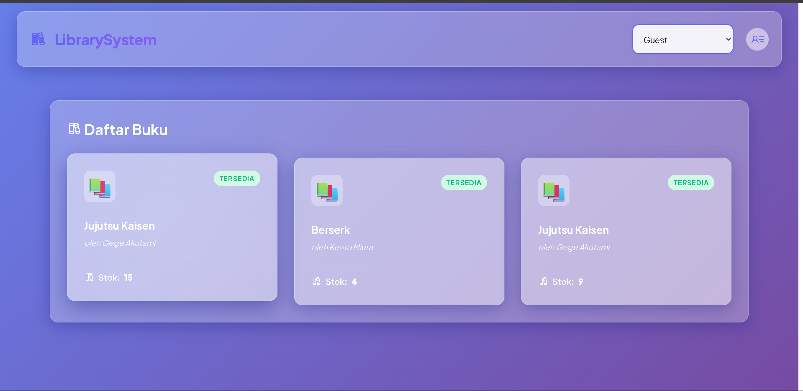 | Halaman utama untuk tamu (Guest), menampilkan daftar buku yang tersedia. |
| 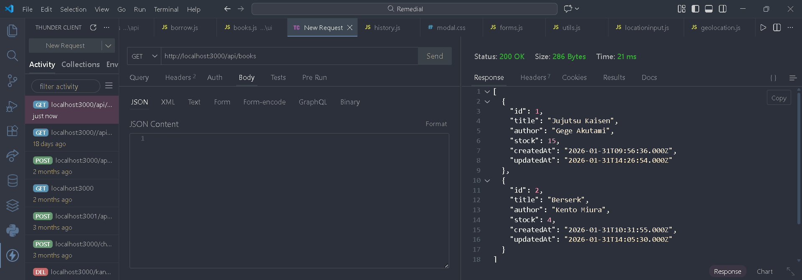 | Tampilan endpoint publik untuk melihat semua buku (API Response). |
| 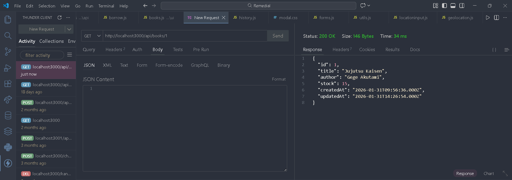 | Tampilan endpoint publik untuk melihat detail satu buku (API Response). |
| 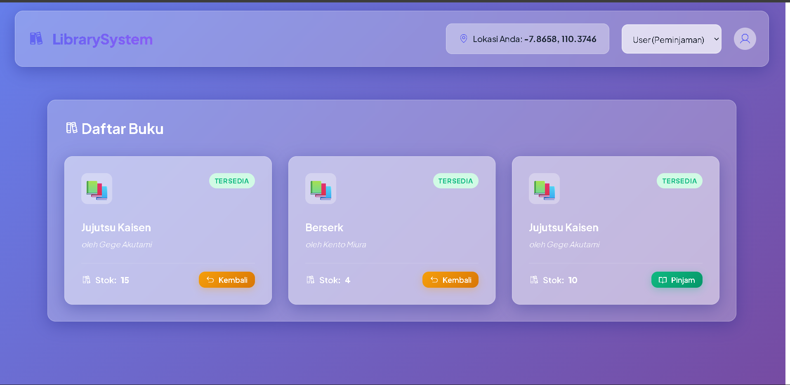 | Dashboard utama saat login sebagai User. |
| 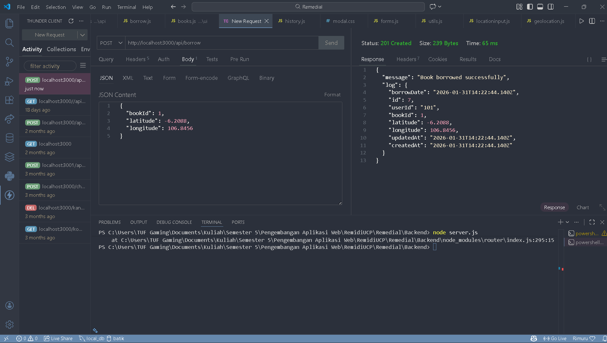 | Bukti request peminjaman buku menggunakan Thunder Client/API. |
| 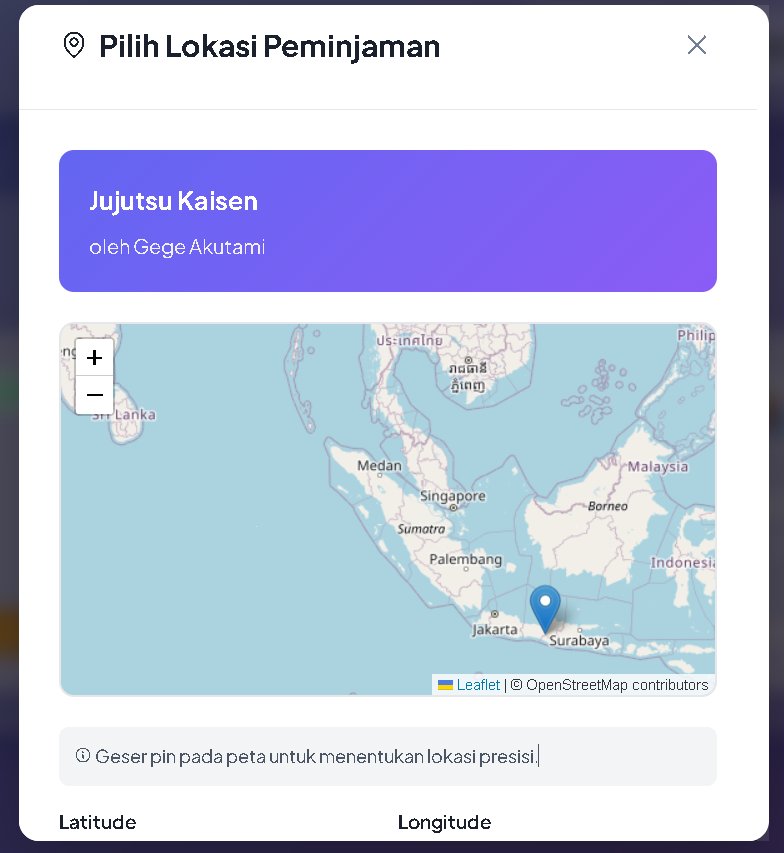 | Flow Peminjaman (1): Modal konfirmasi awal saat tombol Pinjam diklik. |
| 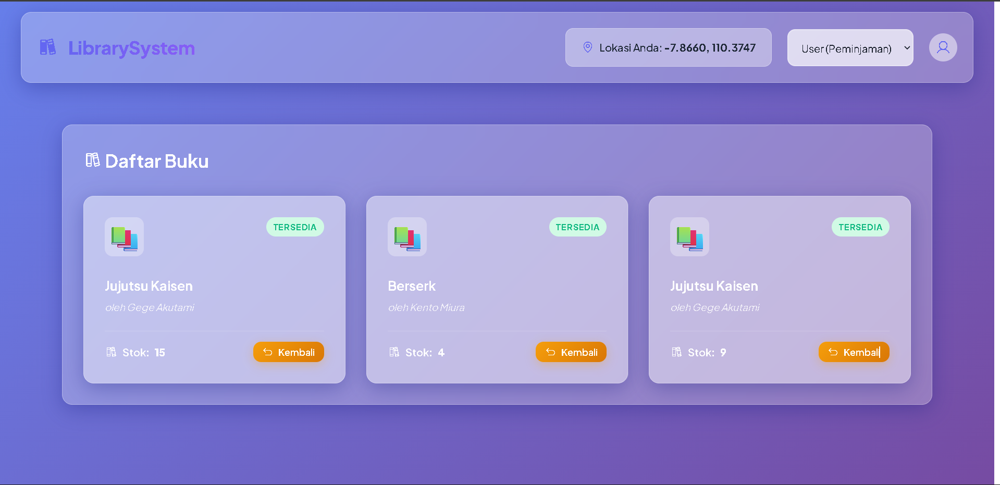 | Flow Peminjaman (2): User memilih lokasi pengantaran di Peta sebelum konfirmasi. |

### 2. Admin Management (Buku & Stok)

| File Screenshot | Keterangan |
| :--- | :--- |
| 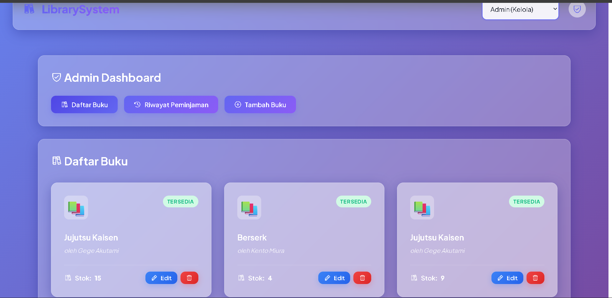 | Dashboard Admin dengan tombol aksi Edit dan Hapus pada setiap buku. |
| 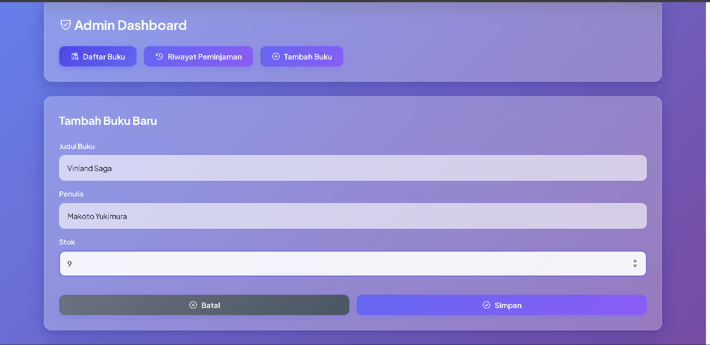 | Form UI untuk Admin menambahkan data buku baru. |
| 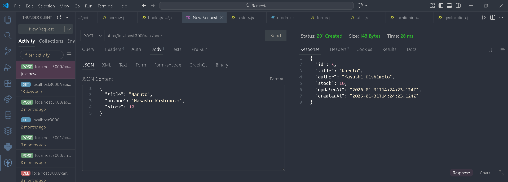 | Response sukses API saat Admin membuat data buku baru. |
| 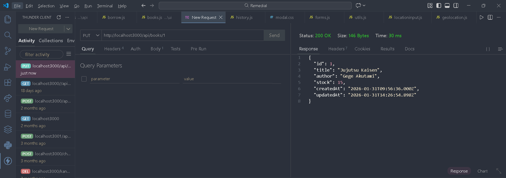 | Response sukses API saat Admin mengupdate data buku. |
| 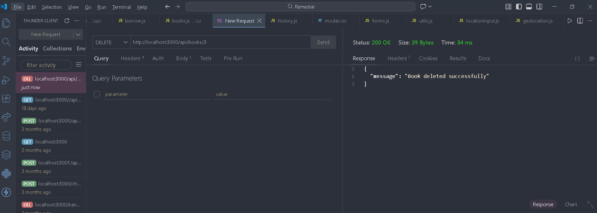 | Response sukses API saat Admin menghapus data buku. |
| 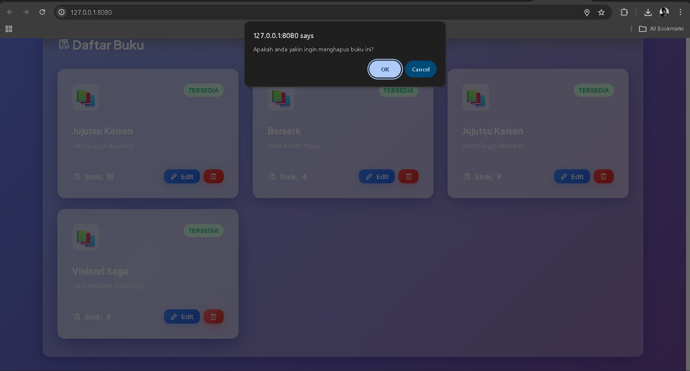 | Tampilan modal konfirmasi penghapusan buku di Website. |
| 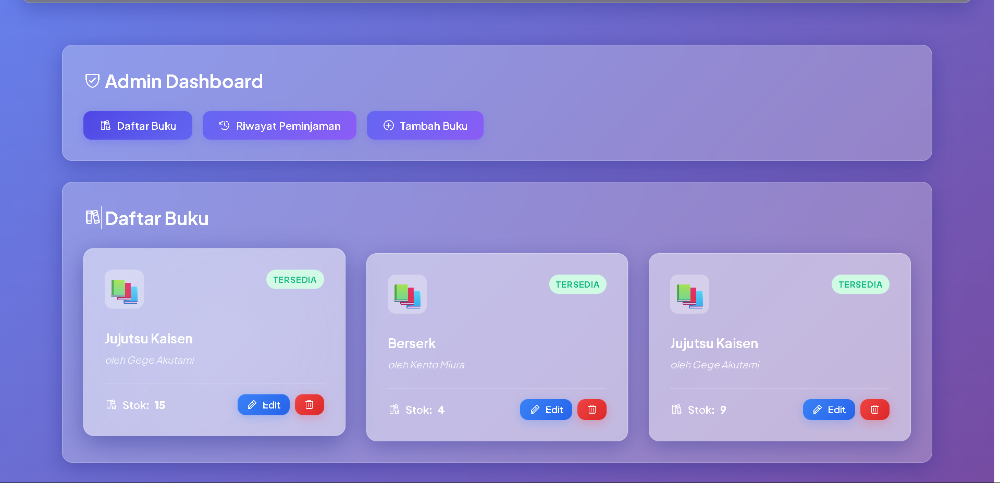 | Tampilan daftar buku setelah data berhasil dihapus (stok/item berkurang). |

### 3. Admin History & Testing Logic

| File Screenshot | Keterangan |
| :--- | :--- |
| 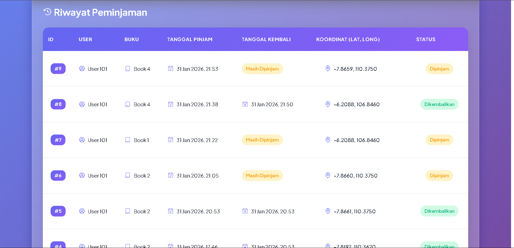 | Tabel Riwayat Peminjaman di Admin Panel (termasuk koordinat lokasi). |
| 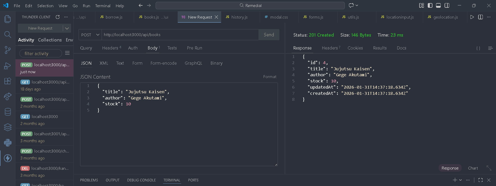 | Testing Flow Admin (1): Cek stok awal sebelum peminjaman. |
| 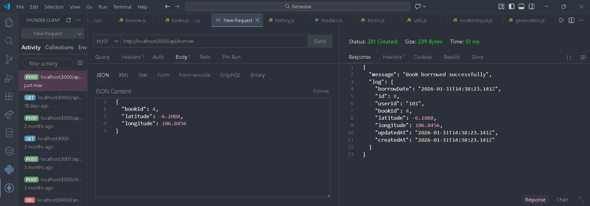 | Testing Flow Admin (2): Eksekusi peminjaman. |
| .png) | Testing Flow Admin (3): Verifikasi stok berkurang otomatis setelah peminjaman. |
| 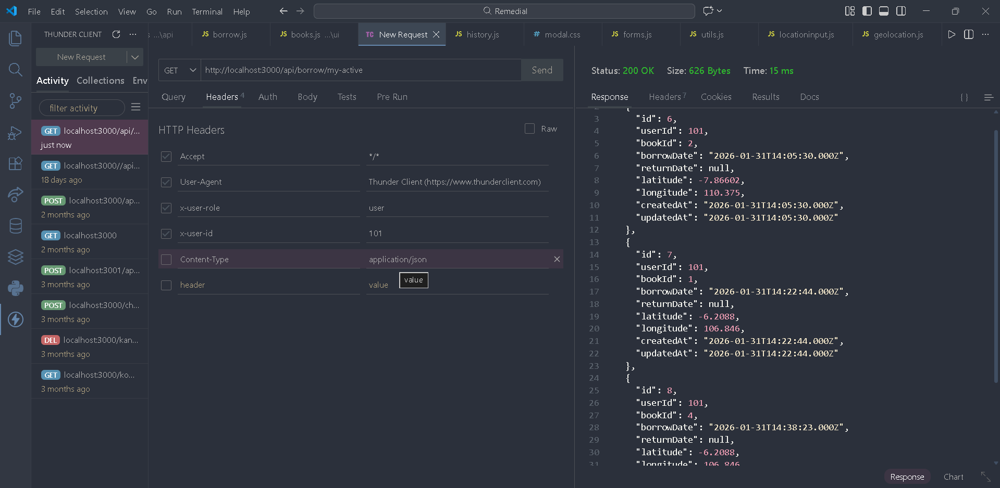 | Testing Flow Admin (4): Verifikasi log peminjaman masuk ke database. |

---

## 🛠️ Teknologi
- **Backend**: Node.js, Express, Sequelize, SQLite3.
- **Frontend**: HTML5, Vanilla CSS (Modern Glassmorphism), Vanilla JS.
- **Maps**: Leaflet.js (OpenStreetMap).
- **Icons**: Phosphor Icons.
